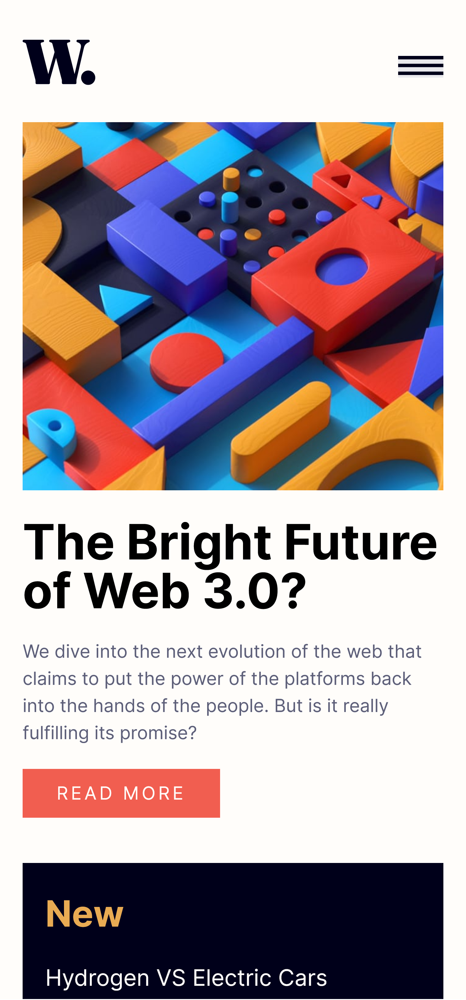
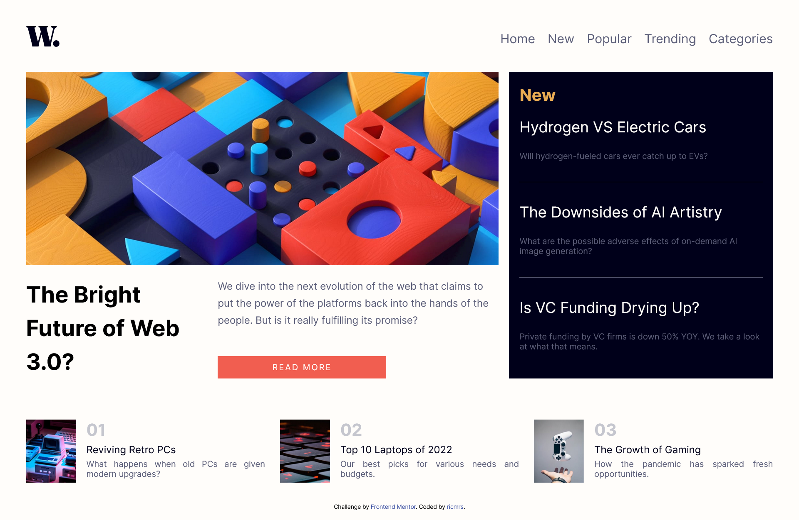

# Frontend Mentor - News homepage solution

This is a solution to the [News homepage challenge on Frontend Mentor](https://www.frontendmentor.io/challenges/news-homepage-H6SWTa1MFl). Frontend Mentor challenges help you improve your coding skills by building realistic projects. 

## Table of contents

- [Overview](#overview)
  - [The challenge](#the-challenge)
  - [Screenshot](#screenshot)
  - [Links](#links)
- [My process](#my-process)
  - [Built with](#built-with)
  - [Continued development](#continued-development)
  - [Useful resources](#useful-resources)
- [Author](#author)

## Overview

### The challenge

Users should be able to:

- View the optimal layout for the interface depending on their device's screen size
- See hover and focus states for all interactive elements on the page

### Screenshot

### Links

- Solution URL: [Add solution URL here](https://your-solution-url.com)
- Live Site URL: [Add live site URL here](https://ricmrs.github.io/News-Homepage/)

## My process

### Built with

- Semantic HTML5 markup
- CSS custom properties
- Flexbox
- CSS Grid
- Mobile-first workflow
- [Sass](https://sass-lang.com/) - For styles

### Continued development

I wanted to try and improve my learnings about SASS style at this project. Overall, i think there is room to improve as there are tools provided by SASS that was not used. Futhermore, this project made me realize that align elements can be hard as i couldn't match some elements and i should be focusing on learning more CSS properties.

### Useful resources

- [W3Schools Modal Example](https://www.w3schools.com/howto/howto_css_modals.asp) - This example helped me build the menu modal on mobile.

## Author

- Linkedin - [Ricardo Macedo](https://www.linkedin.com/in/ricardo-macedo-rosa-silva-bbbb22196/)
- Frontend Mentor - [@ricmrs](https://www.frontendmentor.io/profile/ricmrs)
